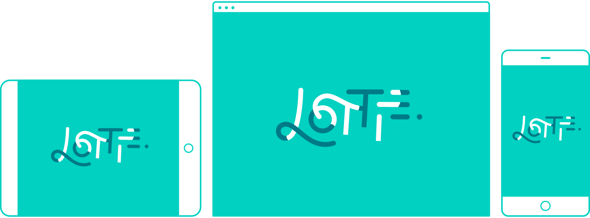

Lottie for React, [React Native](https://github.com/react-community/lottie-react-native), [iOS](https://github.com/airbnb/lottie-ios), and [Android](https://github.com/airbnb/lottie-android)
===

[](https://www.npmjs.com/package/lottie-react-web) [](https://www.npmjs.com/package/lottie-react-native)


<br/><br/>

**Lottie component for React** with runtime animation control.

# Introduction

Lottie is a library for the Web, Android and iOS that parses [Adobe After Effects](http://www.adobe.com/products/aftereffects.html) animations exported as JSON with [bodymovin](https://github.com/bodymovin/bodymovin) and renders them natively on each platform!

For the first time, designers can create **and ship** beautiful animations without an engineer painstakingly recreating it by hand.

*This library is a [react-lottie](https://github.com/chenqingspring/react-lottie) fork that adds the capability for **runtime animation control** and fixes lots of bugs.*

# Getting Started

Get started with Lottie by installing the node module with yarn or npm:

```
yarn add lottie-react-web
```

# Usage

`<Lottie>` component can be used in a declarative way:

```jsx
import React from 'react';
import Lottie from 'lottie-react-web'
import animation from './animation.json'

const App = () => (
  <Lottie
    options={{
      animationData: animation
    }}
  />
)

export default App
```
